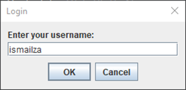
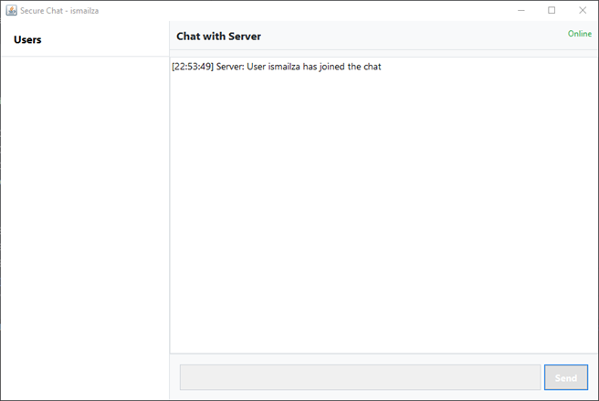
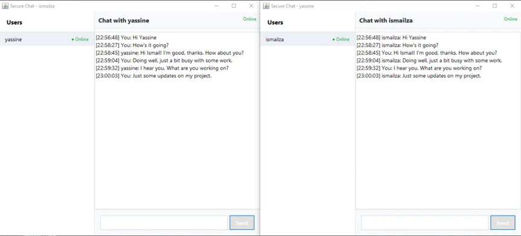
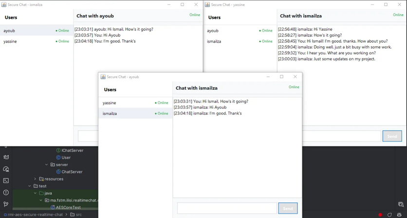

# RMI AES Secure Real-time Chat
A secure real-time chat application using Java RMI and AES-256 encryption for private messaging.

## Features
- AES-256 encryption for secure messaging
- Private messaging between users
- Online/offline status updates
- Real-time message delivery
- User-friendly Swing GUI
- Message timestamps

## Prerequisites
- Java 21+
- Maven

## Technologies
- Java RMI
- AES-256 Encryption
- Java Swing
- Maven

## System Architecture

```plaintext
src/
├── main/java/ma.fstm.ilisi.realtimechat/
│   ├── client/                 # Composants client
│   │   ├── ChatClient          # Client RMI
│   │   ├── ChatController      # Logique de contrôle
│   │   ├── ChatGUI             # Interface utilisateur
│   │   └── IChatController     # Interface du contrôleur
│   │
│   ├── common/                 # Composants partagés
│   │   ├── aes/                # Implémentation AES
│   │   │   ├── AESConstants    # Constantes (S-box, etc.)
│   │   │   ├── AESCore         # Opérations AES
│   │   │   └── AESEncryption   # API de chiffrement
│   │   ├── IChatClient         # Interface RMI client
│   │   ├── IChatServer         # Interface RMI serveur
│   │   └── User                # Modèle utilisateur
│   │
│   └── server/                 # Composants serveur
│       └── ChatServer          # Serveur RMI
│
└── test/                       # Tests unitaires
    └── common/aes/
        ├── AESCoreTest         # Tests du cœur AES
        └── AESEncryptionTest   # Tests du chiffrement
```

The system consists of three main parts:
- **Client**: The client-side application that users interact with. It includes the GUI, controller, and RMI client.
- **Server**: The server-side application that manages user connections and message routing. It includes the RMI server.
- **Common**: Shared components between the client and server, such as the RMI interfaces, user model, and AES encryption implementation.
- **Test**: Unit tests for the AES encryption implementation.

## Screenshots

The login screen where users can enter their username to join the chat.


The initial chat screen shows the list of online users and the chat area.


A conversation between two users with encrypted messages.


Multiple chat windows for private messaging between users.

## Author
- [Ismail ZAHIR](https://github.com/ismailza): [LinkedIn](https://www.linkedin.com/in/ismailzahir01/)
